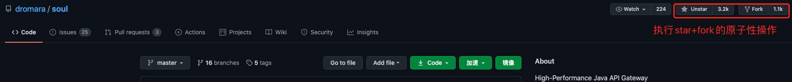
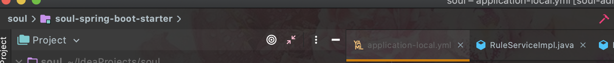

# 从GitHub拉项目
首先从GitHub上star+fork项目到自己的github仓库中,
```
soul项目地址：https://github.com/dromara/soul
如果github慢，可以使用gitee代替：https://gitee.com/shuaiqiyu/soul
```
<!--more-->


然后在自己的仓库，将项目clone到本地。
# 项目构建
clone下来之后，不要着急用IDE打开项目，最好先用命令行执行mvn的命令，将项目整个编译通过再打开。
```
mvn clean install -Dmaven.javadoc.skip=true -Dmaven.test.skip=true
```
等待项目编译完成，期间如果有报错，尝试多编译几次，可能是依赖没下载下来的问题。
等项目编译完成之后，将项目用IDE打开，且记得，IDE的maven已经配置成用本地maven来运行，重写了IDE的maven仓库配置。
因为我用的IDEA，打开项目之后，使用IDEA的构建功能来构建项目(运行项目按钮旁边的小锤子)。

# 配置修改
此时项目构建已经完成80%的工作了，这时候，打开soul-admin模块，在resources目录下的META-INF文件夹下有schema.sql文件，这是soul网关保存各种我们使用网关过程中的各种插件，url限流、鉴权等具体配置信息的表结构。
执行完这个sql脚本创建了表之后，我们再修改application-local.yml文件的一些配置，让网关跑起来


主要修改jdbc相关的配置，soul网关完整的配置说明，可以到官网具体查看
```
项目官网：https://dromara.org/zh-cn/index.html
```
# 启动
因为soul-admin是一个标准的Spring Boot Web项目，配置完成后可以直接运行SoulAdminBootstrap启动网关，只要控制台没有任何报错最后输出如下日志，证明启动成功，这时候浏览器访问对应地址就好，默认端口9095，如果你修改了端口则访问对应端口就好
```
localhost:9095
```

页面展示出soul的登陆界面，默认账户密码都是admin，登陆进去看到首页，至此soul项目搭建成功，可以结合官网学习soul的各个插件以及soul架构，在web控制台随意设置规则学习使用soul了，同时可以后台debug源码，全面掌握soul。
