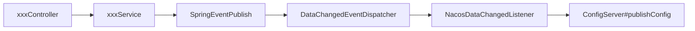
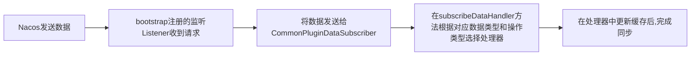

## 前言


- 在soul新版本中添加了nacos的数据同步策略，大致的同步流程如下

  ```mermaid
  graph LR
  
  admin[admin启动向nacos中发送数据] --> nacos[nacos]
  web[web启动时从nacos中拿取数据更新本地缓存] -->nacos[nacos]
  
  nacos1[nacos中的数据发生更改,发送更改数据到web] --> web1[web]
  ```

- 因为目前版本admin中的nacos数据同步，没有在启动时将数据同步到nacos中，所以目前来说，nacos数据同步方案在启动的时候需要手动进行同步，关于nacos同步策略的使用以及可能遇到的坑，可以参考[Soul网关源码阅读（十六）Nacos数据同步示例运行](https://juejin.cn/post/6921170233868845064)
<!--more-->

## Admin同步数据到Nacos


- 首先,我们启动admin因为没有把数据同步到nacos，我们可以手动同步的同时观察admin同步数据到nacos的流程，结合前面的文章介绍，我们知道在admin中soul的数据同步是使用SpringEventPublisher将同步事件分发到DataChangedEventDispatcher监听器之后，再根据配置的同步策略和数据类型进行具体的同步处理
- 实际进行处理的是NacosDataChangedListener，里面各个数据同步的具体方式基本一致，随便挑一个(AppAuth的数据修改)来做说明

```
// 更新appAuth的主体
    public void onAppAuthChanged(final List<AppAuthData> changed, final DataEventTypeEnum eventType) {
      // 首先从nacos拿到配置数据，然后更新AuthMap缓存
        updateAuthMap(getConfig(AUTH_DATA_ID));
     // 根据eventType执行具体策略
        switch (eventType) {
            case DELETE:
                changed.forEach(appAuth -> AUTH_MAP.remove(appAuth.getAppKey()));
                break;
            case REFRESH:
            case MYSELF:
                Set<String> set = new HashSet<>(AUTH_MAP.keySet());
                changed.forEach(appAuth -> {
                    set.remove(appAuth.getAppKey());
                    AUTH_MAP.put(appAuth.getAppKey(), appAuth);
                });
                AUTH_MAP.keySet().removeAll(set);
                break;
            default:
                changed.forEach(appAuth -> AUTH_MAP.put(appAuth.getAppKey(), appAuth));
                break;
        }
        publishConfig(AUTH_DATA_ID, AUTH_MAP);
    }
// 从nacos中获取配置
private String getConfig(final String dataId) {
        String config = configService.getConfig(dataId, GROUP, 6000);
        return StringUtils.hasLength(config) ? config : EMPTY_CONFIG_DEFAULT_VALUE;
    }

// 更新缓存
private void updateAuthMap(final String configInfo) {
        JsonObject jo = GsonUtils.getInstance().fromJson(configInfo, JsonObject.class);
        Set<String> set = new HashSet<>(AUTH_MAP.keySet());
        for (Entry<String, JsonElement> e : jo.entrySet()) {
            set.remove(e.getKey());
            AUTH_MAP.put(e.getKey(), GsonUtils.getInstance().fromJson(e.getValue(), AppAuthData.class));
        }
        AUTH_MAP.keySet().removeAll(set);
    }

// 将新的配置数据重新发布到nacos
private void publishConfig(final String dataId, final Object data) {
        configService.publishConfig(dataId, GROUP, GsonUtils.getInstance().toJson(data));
    }
```

- - 整体的发布流程就是这样：





## Bootstrap从Nacos同步数据


- 在admin修改的数据被同步到nacos后，利用nacos的监听机制，nacos在发生数据变更，会向bootstrap发送修改的数据，接下来看看在bootstrap中，接收到nacos的数据后的具体处理流程，首先把bootstrap的同步配置改为nacos

```
soul: 
    sync: 
        nacos:
            url: localhost:8848
            namespace: 1c10d748-af86-43b9-8265-75f487d20c6c
```

- 我们把bootstrap的数据同步配置改为nacos之后，在bootstrap启动时，会注册一个nacos的监听，用于监听nacos发送的请求，而注册这个nacos监听的位置在NacosCacheHandler#watcherData之中，但是，实际上调用到这个方法，是在NacosSyncDataService里面调用，我们看下二者关系。


- NacosSyncDataService继承了NacosCacheHandler，而在NacosSyncDataService的start方法里是这么写的

```
    public void start() {
        watcherData(PLUGIN_DATA_ID, this::updatePluginMap);
        watcherData(SELECTOR_DATA_ID, this::updateSelectorMap);
        watcherData(RULE_DATA_ID, this::updateRuleMap);
        watcherData(META_DATA_ID, this::updateMetaDataMap);
        watcherData(AUTH_DATA_ID, this::updateAuthMap);
      /*
       watcherData(AUTH_DATA_ID, this::updateAuthMap);完整写法如下：
       
        watcherData(AUTH_DATA_ID, new OnChange() {
            void change(String changeData) {
            this.updateAuthMap();
            }
        });
    }
```

- 在watcherData中就进行了nacos的Listener注册操作

```
protected void watcherData(final String dataId, final OnChange oc) {
  // 每当nacos有变动，就会触发这个Listener，而listener中receiveConfigInfo会实际执行我们之前实例化的匿名对象，最终执行对应的updatexxxMap方法
        Listener listener = new Listener() {
            @Override
            public void receiveConfigInfo(final String configInfo) {
                oc.change(configInfo);
            }

            @Override
            public Executor getExecutor() {
                return null;
            }
        };
  // 一开始启动的时候，nacos并没有数据变动，所以第一次要主动向nacos请求拿取数据进行同步
        oc.change(getConfigAndSignListener(dataId, listener));
        LISTENERS.getOrDefault(dataId, new ArrayList<>()).add(listener);
    }
```

- 等到有数据来了，执行对应的updatexxxMap方法，我们以updatePluginMap为例，看下具体实现

```
protected void updatePluginMap(final String configInfo) {
        try {
          // 实际上里面只做了一件事情，取消旧数据的订阅，在重新订阅当前数据
            // Fix bug #656(https://github.com/dromara/soul/issues/656)
            List<PluginData> pluginDataList = new ArrayList<>(GsonUtils.getInstance().toObjectMap(configInfo, PluginData.class).values());
            pluginDataList.forEach(pluginData -> Optional.ofNullable(pluginDataSubscriber).ifPresent(subscriber -> {
                subscriber.unSubscribe(pluginData);
                subscriber.onSubscribe(pluginData);
            }));
        } catch (JsonParseException e) {
            log.error("sync plugin data have error:", e);
        }
    }
```

- 这里面的关键点pluginDataSubscriber，其类型为PluginDataSubscriber。而这个PluginDataSubscriber的唯一实现则是CommonPluginDataSubscriber，所以实际上调用的是CommonPluginDataSubscriber#unSubscribe和CommonPluginDataSubscriber#onSubscribe方法，这个CommonPluginDataSubscriber，之前数据同步相关文章也提及过，在bootstrap进行数据处理的时候，这是公共的处理bootstrap内本地缓存的地方，**根据不同的数据类型和不同的数据操作类型，选择具体的处理器进行对应缓存更新处理，而具体的处理器，都实现了PluginDataHandler接口，但是并没有重写PluginDataHandler中的所有方法，因此在具体的处理过程中也许会使用默认实现，具体要看数据类型所对应的处理器**

```
private <T> void subscribeDataHandler(final T classData, final DataEventTypeEnum dataType) {
        Optional.ofNullable(classData).ifPresent(data -> {
          // 操作类型和数据类型判断
            if (data instanceof PluginData) {
                PluginData pluginData = (PluginData) data;
                if (dataType == DataEventTypeEnum.UPDATE) {
                  //更新本地缓存
                    BaseDataCache.getInstance().cachePluginData(pluginData);
                  // 更新具体的处理器进行处理。
                  Optional.ofNullable(handlerMap.get(pluginData.getName())).ifPresent(handler -> handler.handlerPlugin(pluginData));
                } else if (dataType == DataEventTypeEnum.DELETE) {
                    BaseDataCache.getInstance().removePluginData(pluginData);
                    Optional.ofNullable(handlerMap.get(pluginData.getName())).ifPresent(handler -> handler.removePlugin(pluginData));
                }
            }
          ......
        });
    }
```

- 当此处数据处理完成之后，一次数据同步就完成了，再来看下bootstrap进行数据同步的流程




## 总结

- 整个nacos的同步流程大致就介绍完成了，其中有个点比较费解，在NacosDataChangedListener中，将Auth修改的数据发送到nacos之前会执行这样的代码

```
private void updateAuthMap(final String configInfo) {
        JsonObject jo = GsonUtils.getInstance().fromJson(configInfo, JsonObject.class);
        Set<String> set = new HashSet<>(AUTH_MAP.keySet());
        for (Entry<String, JsonElement> e : jo.entrySet()) {
            set.remove(e.getKey());
            AUTH_MAP.put(e.getKey(), GsonUtils.getInstance().fromJson(e.getValue(), AppAuthData.class));
        }
        AUTH_MAP.keySet().removeAll(set);
    }
```

- 不明白这样写的目的是什么，因为在执行这个更新操作之前，在admin修改了数据之后，controller到service只是先存入了数据库，然后调用Spring Publisher把数据发送到对应的listener进行修改，此时本地缓存和nacos中还是老的数据，如果要更新缓存和nacos，需要先执行上面的代码，但是上面代码的configInfo是从nacos中拿取的老数据，AUTH_MAP中也是老数据，两个老数据这样操作，不是等于没操作么？？？🤷‍♂️

------

后来经过讨论，这个地方应该是为了集群情况下确保修改缓存之前是从nacos的数据为基础来修改的。