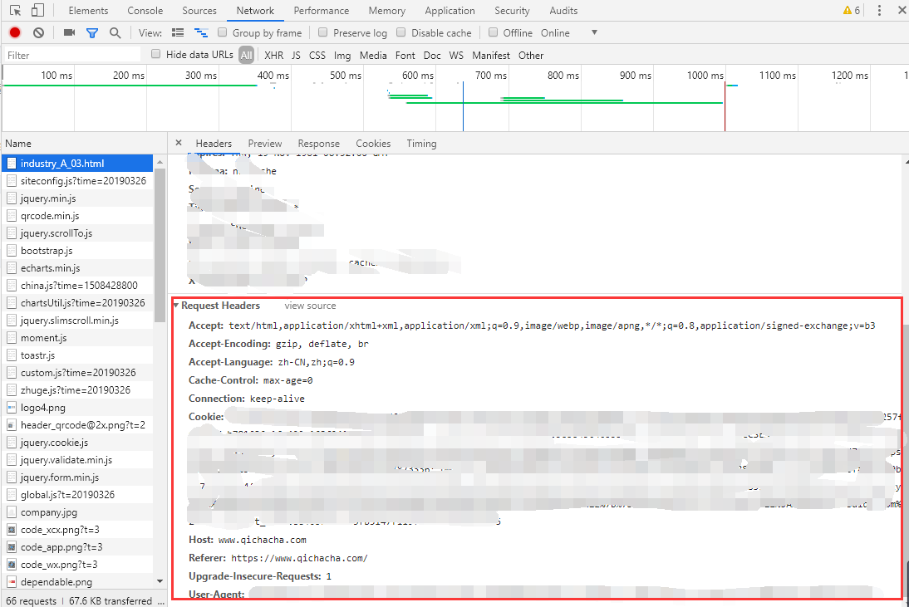

用Java写爬虫我选了webmagic，原因没别的，比起其他爬虫框架这个知道的早一些。看着文档跟百度鼓捣一天，基本功能是搞定了，写一篇文章记录下使用webmagic的过程和对其的理解，方便日后查阅。
<!-- more -->
# WebMagic简单实现爬虫
再爬东西之前，先配置好请求头，因为现在网站一般都有反爬虫技术，所以把头弄好爬的才舒心。
Google Chrome按F12打开调试界面-->network下找到请求头，把信息都复制到Site里
（因为企查查请求方式是GET方式，而天眼查是POST，GET方式的头部会好弄些，所以就拿企查查先爬了）

简单来说，webmagic的爬取工作会先把main方法里填的url对应的网页下载下来，然后在该网页中找到正则或xpath匹配的url，然后放入到page.addTargetRequests队列中，第一次的爬取工作是爬取在main方法中匹配的url，队列中的url每爬取到一条url会把当前url对应的网页下载下来，然后再通过process方法里面的判断逻辑把匹配的url放入队列中待爬。以此类推。
（好尴尬- -，语文学的差，暂时只想到这个解释，个人建议还是看文档动手去爬点东西会理解的更深）

贴代码贴代码！！！
首先先在site定义头部

然后process方法写爬虫核心逻辑

运行！

先爬1000条数据作为测试。

# 总结
目前使用下来，感觉还是比较简单的，没有什么太复杂的地方，（老实说这代码逻辑写的我自己都看着感觉不好，后续改进了），至于webmagic里其他的一些功能之后再尝试，先彻底摸清楚他的工作流程/原理，到时候使用其他高级功能才顺手（嘿嘿）。

---

**2019/4/3更新**

# 实现pipeline接口完成数据持久化
使用pipeline来对爬取到的数据的持久化工作，我是用的spring data jpa，用mybatis的话需要在Dao进行注解配置，相对麻烦。这里是把实现的pipeline作为service来进行数据处理。
因为开了4个线程去进行抓取，不加锁会有线程安全问题，使用了lock来实现加锁。

controller部分如果觉得同步的请求没返回不舒服可以新建一个线程做成异步。

请求后的情况如图

