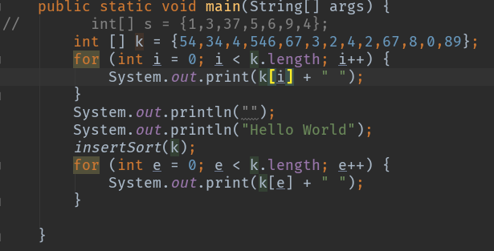
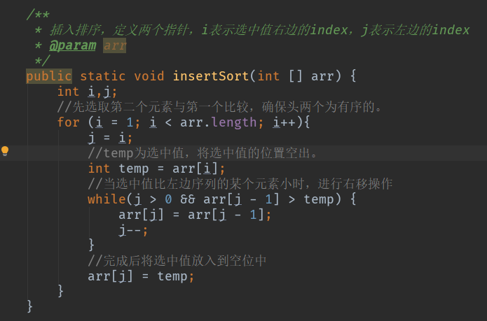
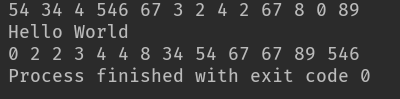

之前写了第一篇之后，就打算写一个排序算法系列的文章，这个是第二篇，这个系列的文章会不定期更新。
<!-- more -->
# 思路
先说下插入算法的思路，在一个序列中，一开始选择一个数temp，这个数是一个定位，如果temp左边序列中某一个元素比其大，则从该元素开始到temp前一个元素都向右移动一位，当temp遇到比其小的元素时，则temp放到该元素之后，假设temp左边的序列都比temp小，则temp位置不变，反之放到最前面。当这个temp与左边序列比较完之后，将temp向右移动一位继续与其左边序列进行比较。

举个例子，一个便利店店员有一堆贴好价格标签的商品要按价格顺序摆放到一个空货架上，怎么摆呢，如果一个一个找价格来顺序摆是不是会很累，这时候用插入排序的思路来摆的话，就根本不用去找价格，只用随便拿一个放到第一个，再拿一个和放上去的比较下价格，价格比它大的都往右移，找到第一个不比它大的价格时就放到后面，以此类推，感觉是不是比一个一个找价格快多了呢。

# 代码示例

*使用插入排序后的结果*

# 总结
插入排序的最坏时间复杂度为O(n^2)，最好为O(n)，当插入排序的序列是逆序时，插入第n个元素都要考虑前面的n-1个元素，数组有序的情况下只用考虑第n-1个元素，它是稳定的排序方法，相同元素的比较其相对位置不会改变，但是其只适用于数量较少的排序，如果数量太大其运算时间很长，在之前写的快排文章，还有一种优化方法就是当基准值某一边的序列中的元素较少且有序时可以直接使用插入排序。
