之前一直在弄自己的github博客，弄好后因为想用sublime写博客，无奈sublime不能联网了，导致装个MarkdownEditing费了好大劲才勉强弄好，今天写下自己的第一篇博客，以作纪念（哈哈哈）。
因为之前在学习算法，第一篇博客就拿算法来开头了，也是对之前学习的一个复习。
<!-- more -->
写之前先拿理论知识铺垫下：
# 时间复杂度
*摘自百度百科*
时间复杂度是同一问题可用不同算法解决，而一个算法的质量优劣将影响到算法乃至程序的效率。算法分析的目的在于选择合适算法和改进算法。
计算机科学中，算法的时间复杂度是一个函数，它定性描述了该算法的运行时间。这是一个关于代表算法输入值的字符串的长度的函数。时间复杂度常用大O符号表述，不包括这个函数的低阶项和首项系数。使用这种方式时，时间复杂度可被称为是渐近的，它考察当输入值大小趋近无穷时的情况。
## 大O符号
*摘自百度百科*
大O符号（Big O notation）是用于描述函数渐进行为的数学符号。更确切地说，它是用另一个（通常更简单的）函数来描述一个函数数量级的渐近上界。在数学中，它一般用来刻画被截断的无穷级数尤其是渐近级数的剩余项；在计算机科学中，它在分析算法复杂性的方面非常有用。

常用的时间复杂度有O(nlogn)、O(n²)、O(n^3)、O(1)、O(n^x)、O(n)等。

# 快速排序
快排的原理类似冒泡排序，不同的是冒泡排序比较的是相邻的两个数，而快排是比较基准值，基准值的选取决定了快排的速度，最慢情况快排的时间复杂度和冒泡排序一样是O(n²)。一般情况下快排的时间复杂度为O(nlogn)。
一般选择基准值的时候可以选择开头或者结尾的元素，但这样选在顺序或逆序情况下时间复杂度就和冒泡一样了，所以快排的其中一种优化方式就是用三数取中法来选择基准值，这种选择即使在极端情况下快排的速度也不会达到O(n²)。

首先，选取序列中开头、中间和结尾的元素，对这三个元素进行排序。
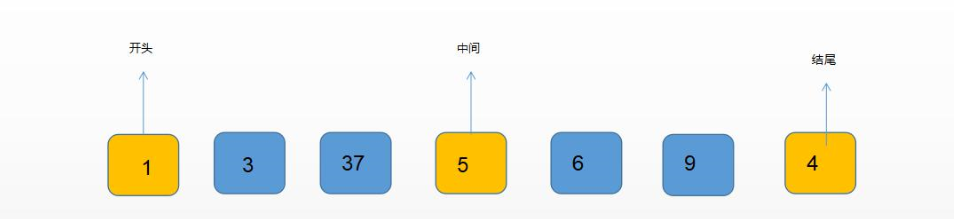

然后将中间位置的元素作为基准值，并放到结尾元素的前面。
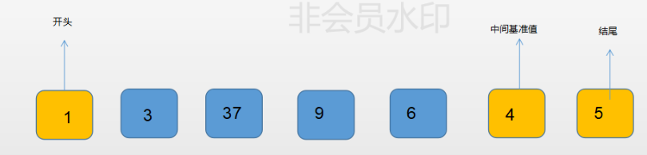

因为基准值在右边，所以我们左指针从左边开始遍历，寻找比基准值大的数，当我们找到后停下，开始用右指针从基准值左边寻找比基准值小的数。
但是右指针与左指针相遇之前都没有找到比基准值小的数，如果左右两个指针相遇且该值大于基准值，则交换基准值与该值的位置。
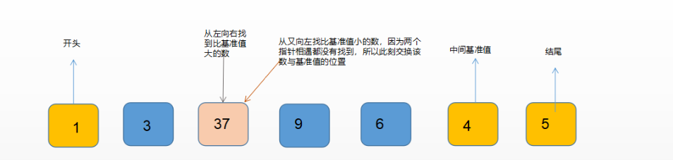

交换位置后的情况
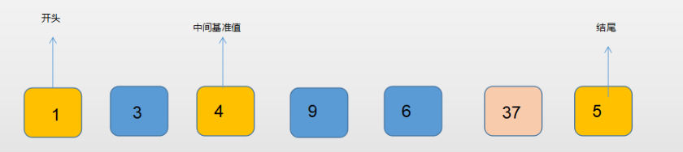

此时基准值4将该序列分成两部分，左边的数均小于4，右边的均大于4。
因为分割后左边只有2个数，所以第二次比较时只用比较一次即可，右边｛9,6,37,5｝同样取头尾，这里偶数取6。
同样的排序换位后就变成这样
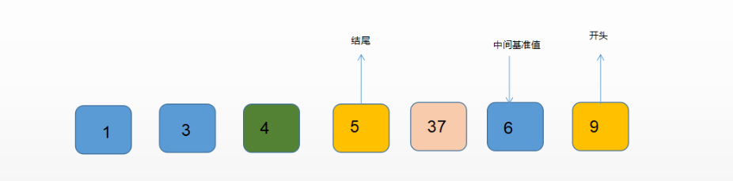
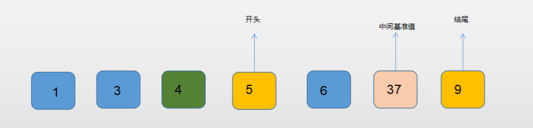
这时右边序列被拆成2部分，左边为5，右边为37，9。
依旧进行递归处理，得到最终结果。
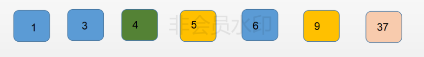

## 代码展示
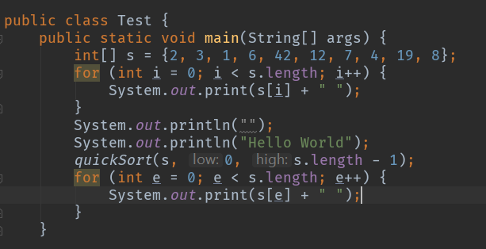
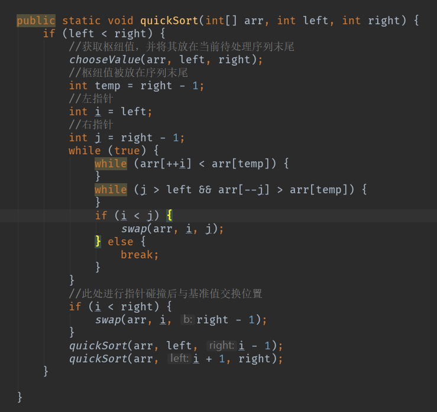
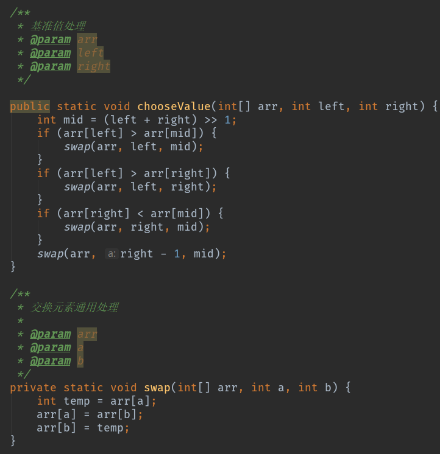
最后输出结果如下
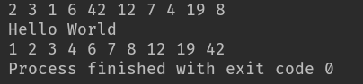

# 总结一下
这是用了3数取中法优化过的快排，平均时间复杂度为O(nlogn)，当然除此之外优化方法还有其他，比如根据拆分的序列长短结合插入排序使用等（这个方法我倒是还没写过，听说效率会更快，有时间去写一个对比下）。
快排的核心就在于基准值的选取，在遇到顺序未知的序列时，尽量想办法选择好基准值，保证快排的效率，不然可能会弄成冒泡的时间复杂度哦。

一枚菜鸡Java Coder写的第一篇博客，如有做得不好的地方，欢迎指正。
作为一名刚入行的coder，写博客的时间虽然晚了些，不过有句话说得好，*种树最好的时候是10年前，其次就是现在*，所以抓紧时间学习，努力尝试养成写博客的习惯，对自己学过的东西能做一个复习、总结，也能为不了解的朋友解惑。
（想想未来还有未知的计算机专业毕业的学生要进入到这个行业，压力山大啊，不抓紧学习就要out了，在此也对业内所以人说一声：加油啊，各位。）