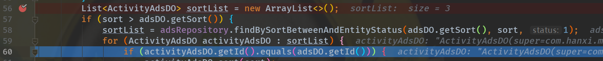
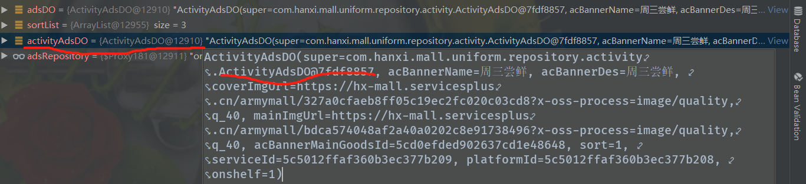
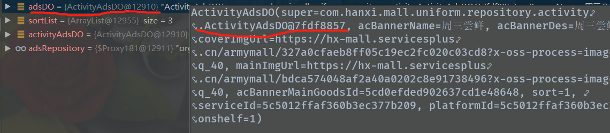

在公司做项目的时候，根据数据库一个排序字段进行排序，在对该字段进行修改的时候，需要保证修改后顺序依然是连续正确的，做的时候我查询了两次，通过ID查询得到要修改的数据修改之前的值，然后再通过序号查询到修改后哪些值的序号需要调整。
<!-- more -->
在循环中进行修改的时候，发现本来修改的ActivityAdsDO的值，但是adsDO的值也改了，最后发现是查询的时候查询出来是同一条数据，只是引用不一样，内存地址是一样的，所以修改ActivityAdsDO等于修改adsDO，在此记录一下，只需要在进行if判断的时候用ID进行判断，其实就可以了

for进行遍历后查询出来的集合，if判断sort值（错误做法，需要改为id判断）

先查询的地址

后查询得到的集合，遍历后的某一个对象的地址，与先查询的一样，是同一个对象，只是引用不同。

